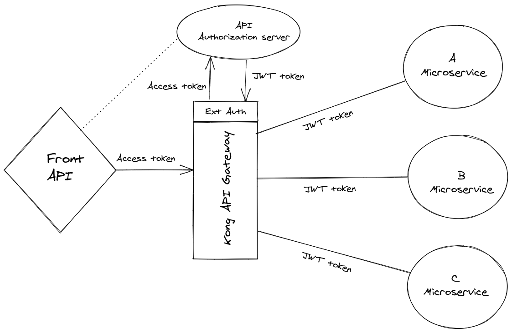

# Kong Ext Auth

Kong plugin to authenticate requests using external HTTP service.

## Description


This plugin lets you authenticate any request using a separate HTTP service.

For every incoming request, the `method`, `path`, `query` and `headers` are forwarded to the auth service (removing the body).

If the service returns `200`, the token in the body of the response (json) is retrieved and returned as the header (Authorization, bearer token) of the main request which continues its normal path. 
In any other case, `401` (Unauthorized) is returned to the client.

## Installation

```bash
$ luarocks install kong-ext-auth
```

Update the `plugins` config to add `kong-ext-auth`:

```
plugins = bundled,kong-ext-auth
```

## Configuration

Add it to a service calling the admin api (also working with Kong DB-less):

```bash
$ curl -X POST http://kong:8001/services/{service}/plugins \
  -d 'name=kong-ext-auth' \
  -d 'config.url=http://auth-service'
  -d 'config.path=/'
```

| Parameter | default | description |
| ---       | ---     | ---         |
| `config.url` | [required] | Service receiving the original request method, query, headers. **HTTP** and **HTTPS** are allowed. |
| `config.path` | [required] | Path to your auth API |
| `config.method` | GET | Method to call API |
| `config.json_token_key` | token | The json key of your auth api response. |
| `config.header_request` | Authorization | Name of the header that forwards the API token.  |
| `config.connect_timeout` | 10000 | Connection timeout (in ms) to the provided url. |
| `config.send_timeout` | 60000 | Send timeout (in ms) to the provided url. |
| `config.read_timeout` | 60000 | Read timeout (in ms) to the provided url. |


## References
This is a fork of https://github.com/aunkenlabs/kong-external-auth
